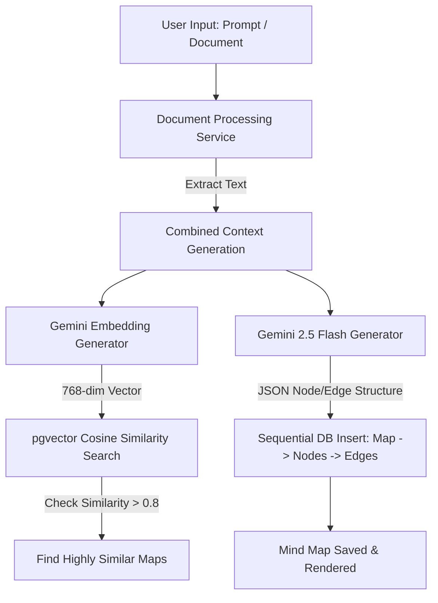

# MindMap — AI-Powered Mind Mapping Platform

MindMap is a state-of-the-art mind mapping platform that lets users auto-generate comprehensive visual mind maps from simple prompts, uploaded files (PDFs, Images), website URLs, or YouTube videos.

---

## 🚀 Key Features Implemented

### 1. 🔐 User Authentication (Phase 1)
- **Secure Registration**: Register new users with password hashing via `bcrypt` (`POST /api/auth/register`).
- **JWT Authorization**: Log in and issue stateless JSON Web Tokens for session handling (`POST /api/auth/login`).
- **Profile Fetching**: Retrieve the authenticated user's session profile using header-based Bearer tokens (`GET /api/auth/me`).

### 2. 📂 Document Management (Phase 1)
- **In-Memory & Disk File Uploads**: Seamless handling of multi-part form uploads using optimized `multer` middleware (`POST /api/documents/upload`).
- **Document Registry**: Save document metadata and access pathways securely in your PostgreSQL instance.
- **Document Retrieval**: Query a list of all your uploaded files, associated properties, and processing metadata (`GET /api/documents`).

### 3. 🧠 Unified Document Parsing & Processing (Phase 2)
- **PDF Extraction**: Immediate text extraction via `pdf-parse`.
- **Image Recognition**: Gemini Vision OCR parses diagrams, flowcharts, or text-heavy images to pull out raw content.
- **Web Scraping**: Custom `cheerio` + `axios` engine parses article body texts, rejecting navbars and footers.
- **YouTube Transcripts**: Fetches official/auto-generated video transcripts using `youtube-transcript`.

### 4. ⚡ AI Core & Vector Similarity Search (Phase 2)
- **High-Performance Vector Embeddings**: Generates context embeddings using **`gemini-embedding-2`** with a custom `outputDimensionality: 768` constraint to perfectly align with standard PostgreSQL index footprints.
- **pgvector Cosine Distance Search**: Uses the native PostgreSQL **`pgvector`** extension to run fast cosine similarity searches (`<=>`) on existing user maps to prevent redundant mind map generations and offer context recommendations.
- **Dynamic Map Generation**: Leverages **`gemini-2.5-flash`** for JSON-governed map schemas (extracting key nodes, semantic edges, hierarchy levels, and relative coordinates).
- **Database Storage Optimization**: Handles sequential database inserts bypassing `$transaction` wrappers to avoid deadlocks under transaction connection pooling schemes (e.g. Neon Pooler).

### 5. 🎨 Interactive React Flow Canvas & Persistence (Phase 3)
- **Fluid Canvas Engine**: Fully interactive infinite canvas leveraging **`@xyflow/react`** (Vite + React 19 + Tailwind v4 CSS) supporting custom node dragging, connections drawing, and zooming.
- **Hierarchical Node Styling**: Custom React Flow nodes styled dynamically by importance: **Concepts** (root, with energetic gradients), **Subconcepts** (branches, with glassmorphism boundaries), and **Details** (leaves, with sleek minimalist cards).
- **Sleek Inspector Drawer**: Side drawer layout triggers on node selection. Allows live editing of labels, modifying tier hierarchies (Concept ↔ Branch ↔ Leaf), and adding rich textual notes.
- **Dynamic Child Spawning (Add Child)**: Rapid mind map expansion via parent node growth. Auto-spawns a child node positioned relative to the parent with automatic source-to-target connections.
- **AI-Driven Auto-Title Summarization**: A sparkling AI action that leverages **`gemini-2.5-flash`** to analyze all current node labels on the canvas and summarize them into a high-context 3–6 word title.
- **pgvector Sync Persistence**: Fully persistent CRUD API. Saving map states clears obsolete records and performs safe bulk inserts, maintaining dynamic updates to pgvector embeddings so search indexes stay perfectly aligned.

### 6. 🔍 Full-Text Search, Document Links, and UI Polish (Phase 4)
- **Advanced Multi-Field Search**: Runs full-text search against map titles, custom map tags, individual node labels, and contributing document names via high-performance Prisma SQL mappings (`GET /api/maps?search=query`). Includes 300ms frontend debounce logic.
- **Implicit Map-Document Linking**: Integrates document parsing and map generation. Newly uploaded documents (PDFs, Images, URLs, YouTube videos) are saved automatically to the `Document` database model and linked to the map via an implicit many-to-many relationship.
- **Contributed Documents Tab**: Sliding settings panel inside the editor includes a dedicated **Documents Used** scrollable list representing uploaded documents that contributed to this map (including direct source download links and document icons).
- **Vector-Similarity Pre-Check Interceptor**: Implements **`POST /api/generate/check-similarity`** endpoint. Generates the context vector embedding and searches existing maps using **`pgvector`**. Intercepts map generation requests if a highly similar map (>70%) is found, giving the user a choice to open the existing map or generate a new map anyway.
- **Blank Canvas Bootstrapper**: Onboarding state checks for zero active canvas nodes and renders a gorgeous glassmorphism onboarding card letting manual builders spawn a root Concept node instantly.
- **Tailwind Breakpoints & Responsive Viewports**: Adapts navigation bars, settings, node inspector, and quick creators beautifully across mobile, tablet, and desktop viewports. Right drawer adapts to `w-full` on mobile viewports for clean navigation.

---

## 🛠️ Architecture & Core Pipeline



---

## ⚙️ Setup & Installation

### Prerequisite Checklist
- [Node.js](https://nodejs.org/) (v18 or higher)
- [PostgreSQL](https://www.postgresql.org/) database with `pgvector` enabled

### 1. Clone & Install Dependencies
```bash
# Install Server Dependencies
cd server
npm install

# Install Client Dependencies
cd ../client
npm install
```

### 2. Configure Environment variables
Create a `.env` file inside the `server/` directory:
```env
DATABASE_URL="postgresql://<username>:<password>@<host>:<port>/<db>?sslmode=require"
PORT=5000
JWT_SECRET="your-jwt-development-secret-key"
GEMINI_API_KEY="AIzaSy..."
```

### 3. Database Migration
Make sure your database has `pgvector` enabled, then run:
```bash
cd server
npx prisma db push
```

### 4. Running the Development Servers
```bash
# Start backend server (port 5000)
cd server
npm run dev

# Start frontend client (port 5173 / 3000)
cd client
npm run dev
```

---

## 🧪 Testing & Verification
To quickly test the end-to-end AI document extraction and generation pipeline without a frontend:
```bash
cd server
node scratch/test-generation.js
```
Expected output:
```json
{
  "message": "Map generated successfully",
  "mapId": "90e6571d-c40a-4b1f-91b0-902845fbee89",
  "similarExistingMaps": [
     {
       "id": "08379bc6-843a-4428-84a8-a12d8b711bef",
       "title": "I want a mind map about artificial intelligence",
       "similarity": 1
     }
  ]
}
```

